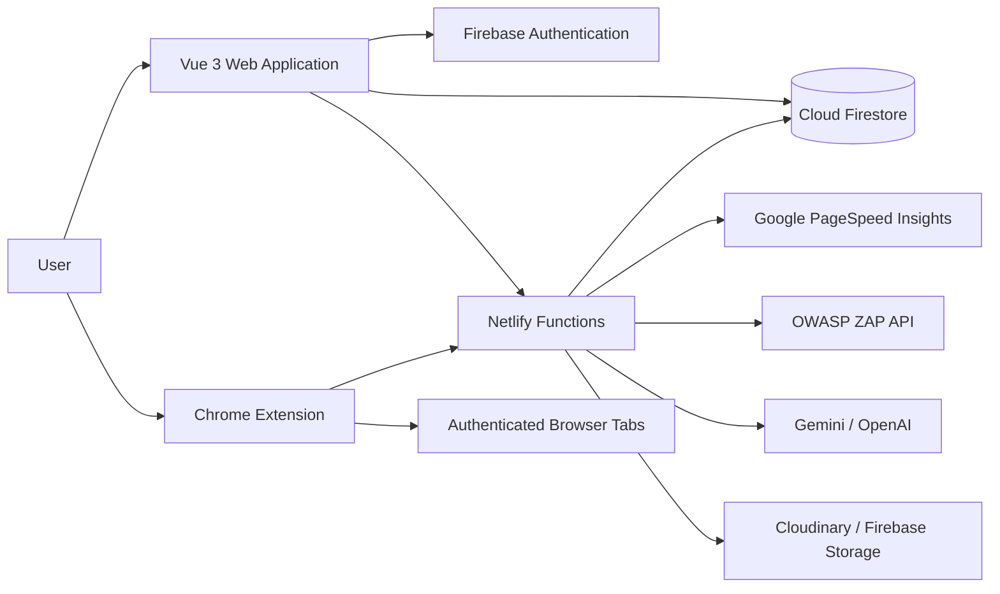
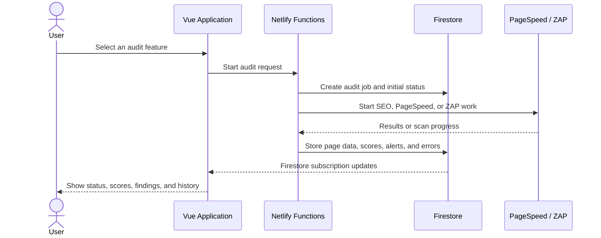

# QA-Suite

QA-Suite is a Vue 3 quality-assurance workspace for SEO crawling, performance audits, security scanning, bug tracking, screenshots, test cases, reporting, and AI-assisted Playwright script generation.

## System Overview

QA-Suite is a web-based quality assurance platform with a companion Chrome extension. It combines automated website analysis with manual QA management in one project workspace. A user creates a project, verifies ownership of the target domain, runs one or more audit types, reviews the findings, and converts important findings into trackable bugs.

The system has three main execution paths:

1. **Web application audits** run server-side through Netlify Functions.
2. **Authenticated extension crawls** run inside the user's browser so existing cookies and login sessions can be used.
3. **Manual QA workflows** manage bugs, screenshots, comments, test cases, reports, and AI-assisted remediation.

## Technology Stack

| Layer | Technology | Responsibility |
| --- | --- | --- |
| Frontend | Vue 3, TypeScript, Vite | Reactive single-page application and route views |
| Styling | Tailwind CSS, component utility classes | Responsive layout, forms, tables, cards, and status states |
| Routing | Vue Router | Authentication-aware navigation and project subpages |
| Client data | Firebase Web SDK | Authentication, Firestore subscriptions, and project data access |
| Backend | Netlify Functions, TypeScript | Audit orchestration, crawlers, PageSpeed, ZAP integration, and AI endpoints |
| Database | Cloud Firestore | Projects, audit jobs, page results, bugs, comments, and test cases |
| File storage | Cloudinary and Firebase Storage configuration | Bug screenshots and uploaded QA evidence |
| Browser extension | Chrome Manifest V3, Vue, TypeScript | Authenticated crawling, active-page audits, and in-page inspection tools |
| SEO analysis | Custom TypeScript crawler and HTML parser | Titles, metadata, headings, links, images, canonical URLs, and robots data |
| Performance analysis | Google PageSpeed Insights API | Lighthouse performance, accessibility, best-practice, and SEO scores |
| Security analysis | OWASP ZAP API | Spidering, active scanning, alerts, risk levels, and remediation details |
| AI assistance | Gemini with optional OpenAI fallback | Remediation guides, test cases, test data, and Playwright script generation |
| Deployment | Netlify and optional Firebase Hosting | Frontend hosting, serverless functions, and SPA routing |

## High-Level Architecture



The frontend is responsible for user interaction and live data presentation. Netlify Functions provide the trusted server boundary for operations that require API keys, Firebase Admin credentials, crawling, or external security services. Firestore acts as the shared persistence layer between the web application, background audit functions, and extension.

## Main Modules

### Web Application

- **Authentication:** Firebase Authentication protects application routes and identifies the current user.
- **Projects:** Stores target URLs, ownership verification, crawl settings, authentication settings, and project members.
- **Page Audits:** Tracks individual URLs and allows separate SEO, PageSpeed, and OWASP ZAP actions for each page.
- **Audit Jobs:** Stores the status and summaries for server-side audit runs.
- **Bug Management:** Converts audit findings into bugs with status, severity, assignees, comments, remediation guides, and screenshots.
- **Test Cases:** Supports manual test cases and AI-generated scenarios with optional Playwright scripts.
- **Reports:** Exports audit and project information for documentation or sharing.

### Chrome Extension

The Manifest V3 extension provides capabilities that are difficult to reproduce from a server:

- Uses the user's active browser cookies for authenticated pages.
- Crawls internal links in the background with pause, resume, stop, and login-loss detection.
- Sends collected page metrics to the project through a project-scoped token.
- Runs active-page SEO/header checks.
- Provides Inspect UI tools inspired by VisBug, including element inspection, spacing, padding, colors, movement, deletion, accessibility checks, and guides.

### Audit Functions

- `bot-seo` performs a breadth-first crawl and stores page-level SEO findings.
- `bot-performance` calls PageSpeed Insights and stores Lighthouse scores and Core Web Vitals.
- `bot-security` starts an OWASP ZAP scan for a target URL.
- `check-zap-status` polls ZAP and stores alert counts and security findings.
- `audit-page-security` and `check-page-security` run and summarize ZAP scans for individual URLs in the Page Audits table.
- `crawl-ingest` receives authenticated extension crawl results.
- `finalize-crawl` closes extension-created audit jobs after traversal completes.

## Audit Data Flow



For a server SEO crawl, the crawler starts from the project target URL, normalizes discovered URLs, enforces the target domain, checks robots rules for discovered links, and stores page findings under the audit job. The requested start page is still inspected so a restrictive `robots.txt` cannot produce a misleading zero-page audit.

For PageSpeed, the system stores Performance, Accessibility, Best Practices, and SEO scores together with FCP, LCP, CLS, Speed Index, and TTI. A score is displayed only after the performance bot completes successfully; pending or failed results are shown as unavailable rather than as a real zero.

For OWASP ZAP, the system supports both project-level scans and individual Page Audits scans. Individual scans store their own scan ID, progress, counts, alert names, descriptions, and solutions so security findings remain associated with the URL that produced them.

## Firestore Data Model

```text
projects/{projectId}
	- name, targetUrl, ownershipVerified
	- members, authSettings, crawl limits
	- extensionApiToken hash

audit_jobs/{jobId}
	- projectId, crawlMode, status, timestamp
	- summaries.seo
	- summaries.security
	- summaries.performance

audit_jobs/{jobId}/pages/{pageId}
	- URL, title, metadata, headings, images, links, SEO issues

audit_jobs/{jobId}/vulnerabilities/{vulnerabilityId}
	- ZAP alert, risk, URL, evidence, solution

audit_jobs/{jobId}/performance_metrics/{metricId}
	- FCP, LCP, CLS, Speed Index, TTI

projects/{projectId}.customPages
	- tracked Page Audits URLs and their SEO, PageSpeed, and ZAP results

bug_list/{bugId}
	- projectId, source, severity, status, description, screenshots
```

## Security and Reliability

- Firebase Authentication protects authenticated web routes.
- Firestore access is scoped by project membership and ownership rules.
- Extension tokens are project-scoped and stored server-side as SHA-256 hashes.
- API keys and service-account credentials remain in environment variables.
- Audit job IDs are validated against the authenticated project before ingestion.
- Crawl URLs are normalized to reduce duplicate page records.
- Audit page ingestion is idempotent for normalized URLs.
- Background audit functions update individual bot statuses and the overall audit status.
- Crawl pause, resume, stop, and worker restart states are persisted in extension storage.
- ZAP and PageSpeed failures are surfaced as explicit status or error states rather than silently appearing as valid results.

## Testing and Verification

The project uses build and type-check commands as baseline verification:

```powershell
npm --prefix frontend run build
npm --prefix netlify/functions run typecheck
npm --prefix extension run typecheck
npm --prefix extension run build
```

Manual verification should include:

- Starting a server SEO audit and confirming page records appear.
- Running PageSpeed and confirming all four Lighthouse scores update.
- Running an OWASP ZAP scan with ZAP reachable and reviewing alert details.
- Running a per-page ZAP scan from Page Audits and opening its findings popup.
- Starting an authenticated extension crawl and checking that discovered URLs appear in Page Audits.
- Pausing, resuming, and stopping an extension crawl.
- Creating a bug from an audit finding and attaching evidence.

## Current Features

- Firebase Authentication and Firestore project workspaces.
- Server-side SEO BFS crawling through Netlify Functions.
- Optional authenticated crawling through the Manifest V3 Chrome extension, including pause/resume and login-loss detection.
- Active-tab audits for SEO, headers, images, links, social metadata, and security checks.
- Browser-based Inspect UI tools, mock data/autofill helpers, and a responsive Screen Simulator.
- Google PageSpeed Insights mobile audits, with scores and Lighthouse metrics stored in Firestore.
- Optional OWASP ZAP security scans through a self-hosted ZAP API.
- Collaborative bug list with comments, statuses, assignees, remediation guides, and screenshot uploads through Cloudinary.
- Manual test case creation plus AI-generated test cases, test data, remediation guides, and Playwright TypeScript scripts for sandboxed CI use.
- Audit history, trend charts, lazy-loaded audit details, and PDF report export.
- Responsive desktop/mobile navigation and project views.

## Local Development

### Prerequisites

- Node.js 18 or newer.
- Netlify CLI available through `npx`.
- A Firebase project with Authentication and Firestore configured.
- Optional: OWASP ZAP desktop running with its API on `127.0.0.1:8080`.

### Install

```powershell
cd "C:\Users\Asus\Documents\QA web 2"
npm --prefix frontend install
npm --prefix netlify/functions install
npm --prefix extension install
```

### Configure the frontend

Create `frontend/.env.local` (or another Vite-supported local env file) with the Firebase client settings used by the web app:

```env
VITE_FIREBASE_API_KEY=your_firebase_api_key
VITE_FIREBASE_AUTH_DOMAIN=your_firebase_auth_domain
VITE_FIREBASE_PROJECT_ID=your_firebase_project_id
VITE_FIREBASE_MESSAGING_SENDER_ID=your_firebase_messaging_sender_id
VITE_FIREBASE_APP_ID=your_firebase_app_id
VITE_NETLIFY_FUNCTIONS_URL=/.netlify/functions
```

`VITE_NETLIFY_FUNCTIONS_URL` is optional and defaults to `/.netlify/functions`.

### Configure server secrets

Create `netlify/.env` locally. Never commit it or paste its contents into tickets, screenshots, or chat.

```env
FIREBASE_SERVICE_ACCOUNT_KEY={...}
FIREBASE_PROJECT_ID=your_firebase_project_id
FIREBASE_PRIVATE_KEY=optional_private_key
FIREBASE_CLIENT_EMAIL=optional_service_account_email
ALLOWED_ORIGINS=http://localhost:5175
PAGESPEED_API_KEY=AIza...
ZAP_API_URL=http://127.0.0.1:8080
ZAP_API_KEY=your_zap_api_key
CLOUDINARY_CLOUD_NAME=your_cloud_name
CLOUDINARY_API_KEY=your_cloudinary_key
CLOUDINARY_API_SECRET=your_cloudinary_secret
GEMINI_API_KEY=your_gemini_key
OPENAI_API_KEY=optional_fallback_key
SMTP_HOST=smtp.gmail.com
SMTP_PORT=465
SMTP_SECURE=true
SMTP_USER=your_gmail_address@gmail.com
SMTP_PASS=your_gmail_app_password
SMTP_FROM=QA-Suite <your_gmail_address@gmail.com>
```

`PAGESPEED_API_KEY` must be a Google API key, not a service-account JSON document or service-account key ID. Enable the PageSpeed Insights API for the same Google Cloud project.

`FIREBASE_SERVICE_ACCOUNT_KEY` may be raw service-account JSON or Base64-encoded JSON. Alternatively, configure `FIREBASE_PRIVATE_KEY` and `FIREBASE_CLIENT_EMAIL` with the Firebase project ID. `GEMINI_API_KEY` is the primary AI credential; `OPENAI_API_KEY` is an optional fallback used by the AI functions.

For Gmail SMTP, use an App Password (not your normal Gmail password). If you are using port `465`, keep `SMTP_SECURE=true`.

### Start every local session

1. Start OWASP ZAP if security scanning is needed and confirm its API is enabled on port `8080`.
2. From the repository root, run:

```powershell
npx netlify dev --port 8888
```

3. Open the website at `http://localhost:5175`.
4. Keep the Netlify process running on port `8888`; Vite proxies `/.netlify/functions/*` to it.

To use the extension locally, open `chrome://extensions`, enable **Developer mode**, choose **Load unpacked**, and select `extension/dist` after building it. Configure the extension with a project ID and a project-scoped extension token issued by the web app.

Do not use `http://localhost:8888` as the browser entry point for this repository. It is the Netlify proxy/backend port and may serve the HTML fallback instead of Vite modules.

Optional checks:

```powershell
Test-NetConnection 127.0.0.1 -Port 8080
Test-NetConnection 127.0.0.1 -Port 8888
```

### Build and type-check

```powershell
npm --prefix frontend run build
npm --prefix frontend run preview
npm --prefix netlify/functions run typecheck
npm --prefix netlify/functions run build
npm --prefix extension run typecheck
npm --prefix extension run build
```

The extension build output is `extension/dist`. The frontend production preview is served by Vite on its reported preview port.

## Audit Flow

1. Sign in and open a project.
2. Confirm domain ownership.
3. Verify domain ownership, then click **Run Audit** and select Server or Chrome Extension crawl mode.
4. Choose the audit scope: `all`, `seo`, `security`, or `performance`.
5. `start-audit` requires `ownershipVerified === true`, creates an `audit_jobs` document, and starts the applicable independent bot functions.
6. The SEO bot crawls up to the configured page limit.
7. The performance bot calls PageSpeed Insights with the mobile strategy and stores scores from `lighthouseResult.categories`.
8. The security bot starts a ZAP scan when ZAP is reachable; the frontend polls its status every 30 seconds.
9. Results and bot errors are written to Firestore and displayed in the project view.

Bot summaries are updated independently. Once all applicable bot summaries reach terminal states, the overall audit job is set to `completed` or `partial-failed`.

## Main Routes

- `/login`
- `/dashboard`
- `/projects`
- `/projects/:id` — Page Audits workspace and default project detail page
- `/projects/:id/overview` — legacy route redirected to the Page Audits workspace
- `/projects/:id/pages` — legacy route redirected to the Page Audits workspace
- `/projects/:id/audit/:auditId`
- `/projects/:id/bugs`
- `/projects/:id/test-cases`
- `/projects/:id/history`
- `/notifications`

## Project Structure

```text
frontend/                 Vue 3, Vite, Tailwind CSS, Firebase client, views and components
netlify/functions/        TypeScript Netlify Functions and shared Firebase Admin helpers
extension/                Manifest V3 Vue/TypeScript companion extension
device-simulator-extension/ Auxiliary browser screen simulator extension
inspect ui source from visbug/ Reference VisBug-style UI inspection assets
firestore.rules           Firestore security rules
firestore.indexes.json    Firestore composite indexes
storage.rules             Firebase Storage security rules
netlify.toml              Netlify build, functions, redirects, and local dev configuration
firebase.json              Firebase Hosting, Functions, Firestore, Storage, and emulator configuration
```

## Deployment

Netlify is configured to build the frontend from `frontend`, publish `frontend/dist`, and serve `netlify/functions` with SPA fallback redirects. Firebase Hosting is also configured in `firebase.json` with the same `frontend/dist` output, alongside Firebase Functions, Firestore, Storage, and local emulators.

The configured Firebase emulator ports are Auth `9099`, Functions `5001`, Firestore `8080`, Hosting `5000`, and Emulator UI `4000`.

## Available Functions

The main serverless entry points include `start-audit`, `preflight-check`, `bot-seo`, `bot-performance`, `bot-security`, `audit-single-page`, `audit-page-speed`, `audit-page-security`, `crawl-ingest`, `finalize-crawl`, `issue-extension-token`, `verify-extension-token`, `upload-bug-screenshot`, `generate-remediation`, `generate-playwright`, `generate-test-cases`, and `generate-test-data`.

## Security Notes

- Keep Firebase service-account JSON, API keys, Cloudinary secrets, and AI keys in environment variables only.
- Rotate any credential that has appeared in a screenshot or chat message.
- Run ZAP and crawlers only against domains you own or are authorized to test.
- AI-generated Playwright scripts are downloads only and must run in an isolated test environment, never automatically against production.
